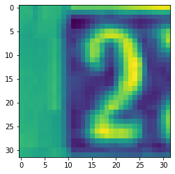
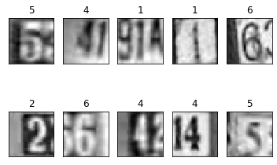
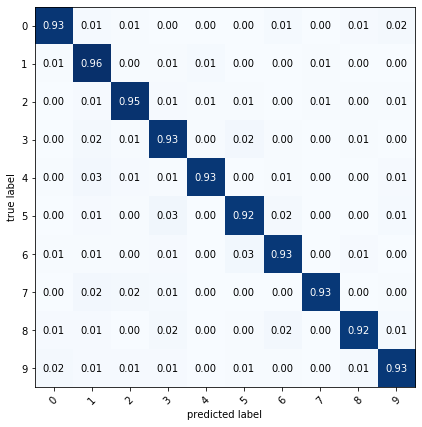
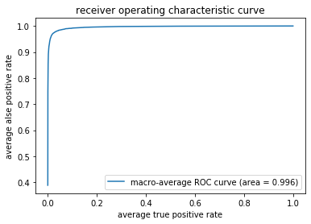

# Digit Recognizer
Convolutional Neural Network created using Keras with tensorflow backend. This neural network is used to predict which digit is on a photo.

## Training data

Google's SVHN was used to train this model.

## Input

Input to the model is a 32x32 image conataining one digit.

  

## Model
Model uses Conv2D layers, along with Dropuot, MaxPooling2D, Flatten and dense layers to categorize photos into categories each representing one digit.

  

## Output
Models output is a digit from 0 to 9 which represents the digit recognized on the photo

  

## Model evaluation

| Accuracy  | 94% |
|-----------|-----|
| Recall    | 93% |
| Precision | 93% |
| F1 Score  | 94% |

  

  

